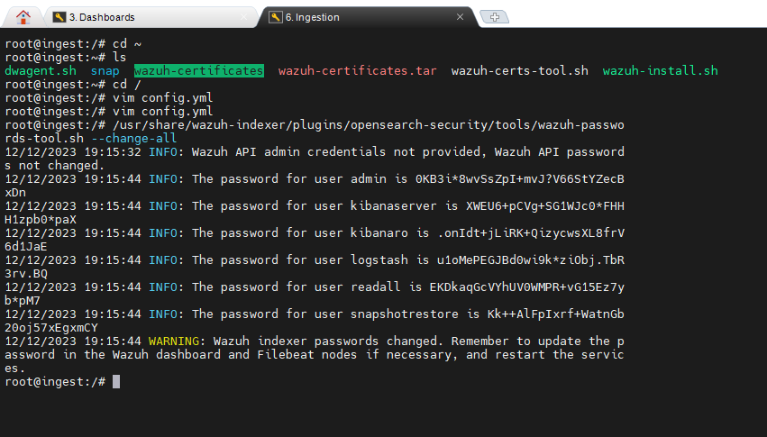

---
layout:
  title:
    visible: true
  description:
    visible: false
  tableOfContents:
    visible: true
  outline:
    visible: true
  pagination:
    visible: true
---

# Stockage des Journaux

## Wazuh-Indexer

L'indexeur Wazuh est un moteur de recherche et d'analyse en texte intégral hautement évolutif. Ce composant central de Wazuh indexe et stocke les alertes générées par le serveur Wazuh et fournit des capacités de recherche et d'analyse de données en temps quasi réel.&#x20;

source : [https://documentation.wazuh.com/current/installation-guide/wazuh-indexer/index.html](https://documentation.wazuh.com/current/installation-guide/wazuh-indexer/index.html)

## Installation de Wazuh Indexer

### Prérequis

```
#apt-get install debconf adduser procps
#apt-get install gnupg apt-transport-https
```

### Création des Certificats

On télécharge le script wazuh-certs-tool.sh et le fichier config.yml depuis le site Wazuh qui vont nous servir à la création des certificats.

```
curl -sO https://packages.wazuh.com/4.7/wazuh-certs-tool.sh
curl -sO https://packages.wazuh.com/4.7/config.yml
```

Modification du fichier <mark style="color:blue;">**config.yml**</mark>&#x20;

<figure><figcaption></figcaption></figure>

On crée les certficats qu'on va deployer sur notre noeud (Sur une config multi cluster, ils doivent etre deployés sur chaque noeud du cluster) et on profite pour les decompresser dans un repertoire du meme nom

```
bash ./wazuh-certs-tool.sh -A
tar -cvf ./wazuh-certificates.tar -C ./wazuh-certificates/ .
```

<figure><figcaption><p>Les certificats crées</p></figcaption></figure>

### Import de la clé GPG

<pre><code>curl -s https://packages.wazuh.com/key/GPG-KEY-WAZUH | gpg --no-default-keyring --keyring gnupg-ring:/usr/share/keyrings/wazuh.<a data-footnote-ref href="#user-content-fn-1">gpg </a>--import &#x26;&#x26; chmod 644 /usr/share/keyrings/wazuh.gpg
</code></pre>

### Ajout des sources&#x20;

```
echo "deb [signed-by=/usr/share/keyrings/wazuh.gpg] https://packages.wazuh.com/4.x/apt/ stable main" | tee -a /etc/apt/sources.list.d/wazuh.list
```

### Installation du paquet

```
apt-get -y install wazuh-indexer
```

A présent je modifie le fichier /etc/wazuh-indexer/opensearch.yml pour adapter les parties suivantes :&#x20;

1. <mark style="color:green;">network.host</mark>
2. <mark style="color:green;">node.name</mark>
3. <mark style="color:green;">cluster.initial\_master\_nodes</mark>

<figure><figcaption></figcaption></figure>

### Configuration des certificats de Wazuh indexer

```bash
# Créeation du répertoire des certificats
mkdir /etc/wazuh-indexer/certs

# Extraction des certificats de l'archive et les déplacer
tar -xf ./wazuh-certificates.tar -C /etc/wazuh-indexer/certs/ ./$NODE_NAME.pem ./$NODE_NAME-key.pem ./admin.pem ./admin-key.pem ./root-ca.pem

# Définission des permissions sur le répertoire des certificats et les certificats
chmod 500 /etc/wazuh-indexer/certs
chmod 400 /etc/wazuh-indexer/certs/*

# Changement du propriétaire du répertoire des certificats
chown -R wazuh-indexer:wazuh-indexer /etc/wazuh-indexer/certs

```

Definition d'une variable d'environement pour eviter de preciser le nom du noeud lors du deploiement de certificats

```
NODE_NAME=ingest.phoenix.local
```

Nous devons modifier le fichier <mark style="color:blue;">/etc//opensearch.yml</mark> pour accorder les noms des certificats

<figure><figcaption></figcaption></figure>

### **Optimisation**

L'indexeur Wazuh peut fonctionner d'une mauvaise façon si un processus est écris sur le disque au lieu de la RAM (Swaping) , en modifiant les fichiers suivants nous allons verouiller les processus sur la memoire pour qu'il n'y ait pas de swap.

1. <mark style="color:blue;">/etc/wazuh-indexer/opensearch.yml</mark>

```bash
bootstrap.memory_lock: true
```

2.  Limitation des ressources systemes&#x20;

    <mark style="color:blue;">/usr/lib/systemd/system/wazuh-indexer.service</mark>

```
[Service]
LimitMEMLOCK=infinity
```

3.  Limitation de la memoire&#x20;

    <mark style="color:blue;">/etc/wazuh-indexer/jvm.options</mark>

```
# Xms represents the initial size of total heap space
# Xmx represents the maximum size of total heap space
-Xms4g
-Xmx4g
```

### Démarrage du service

```
systemctl daemon-reload
systemctl enable wazuh-indexer
systemctl start wazuh-indexer
```

<figure><figcaption></figcaption></figure>

**Initialisation du Cluster**

L'exécution du script <mark style="color:blue;">indexer-security-init.sh</mark> nous permet de charger les nouvelles informations de certificats et démarrer notre cluster (1 seul nœud dans notre cas).

### Sécurisation  de notre Installation <a href="#id-5a34" id="id-5a34"></a>

On va exécuter sur notre indexeur le script proposé par Wazuh pour changer changer les mots de passe par défaut&#x20;

```
/usr/share/wazuh-indexer/plugins/opensearch-security/tools/wazuh-passwords-tool.sh --change-all
```

<figure><figcaption></figcaption></figure>

Notre installation est sécurisé et complètement opérationnel à ce point.

[^1]: 
